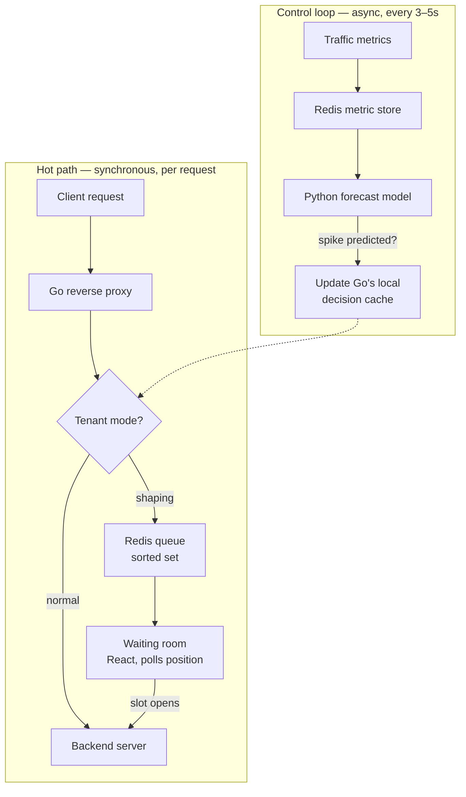

# AutOps — Autonomous Predictive Traffic Shaping Gateway

> Working title: **Autonomous DevOps**. A network-level reverse-proxy gateway that predicts traffic spikes before they crash your backend, and proactively shapes traffic instead of waiting to react.

Final-year Software Architecture thesis project — ICT University, defense early 2027.

## The problem

Most backends are **reactive**: they wait until CPU/traffic crosses a threshold, then try to scale. Scaling has a cold-start lag of 30–90 seconds — during that window, the original server is already overwhelmed. This is exactly what happens on synchronized-demand events like exam-results day: thousands of users hit the same endpoints in the same few minutes, and the site goes down before new capacity comes online.

## The idea

AutOps sits in front of your app (DNS points to it, no code changes needed) and does two things:

- **Predicts** — a lightweight forecasting model watches live traffic trajectory and forecasts spikes 60–120 seconds ahead
- **Shapes** — if a spike is predicted, the gateway proactively offloads static assets, queues non-critical routes, and virtually queues the rest — before the backend is overwhelmed, not after

This is a request-shaping response to a predicted spike, not just earlier infrastructure autoscaling — that's the core academic contribution.

## Architecture



Two zones, kept strictly separate so the ML model never sits on the request's critical path — the proxy only ever does a local memory lookup per request.

## Tech stack

| Layer | Tech | Purpose |
|---|---|---|
| Reverse proxy | Go | Low-latency request routing, mode lookup |
| Queue & metrics | Redis | Sorted-set virtual queue, traffic time series |
| Forecasting | Python | Time-series spike prediction (ARIMA baseline → Random Forest/LSTM) |
| Dashboard & waiting room | React | Tenant config panel + live queue UI |
| Load testing | k6 / Locust | Simulated spike generation for training and evaluation |

## Status

🚧 Early stage — building the bare Go proxy MVP first (no AI, no queue yet) to establish a latency baseline before layering on prediction and shaping. See the roadmap below.

## Roadmap

- [ ] Go reverse proxy MVP + latency baseline
- [ ] Manual (hardcoded) mode switching — normal ↔ shaping
- [ ] Redis-backed virtual queue (sorted set)
- [ ] Traffic metrics pipeline
- [ ] Forecast model (baseline → Random Forest/LSTM)
- [ ] Wire prediction → decision cache → proxy
- [ ] Multi-tenant config + dashboard
- [ ] Evaluation: reactive vs predictive benchmark

## Getting started

```bash
git clone https://github.com/<your-username>/<repo-name>.git
cd <repo-name>
```

Prerequisites: Go 1.22+, Redis, Python 3.11+, Node.js 18+ (added incrementally as each milestone is built — not all needed on day one).

## Notes

This is an active academic thesis project built iteratively with AI-assisted pair programming. Design decisions and rationale are tracked as the project evolves.
